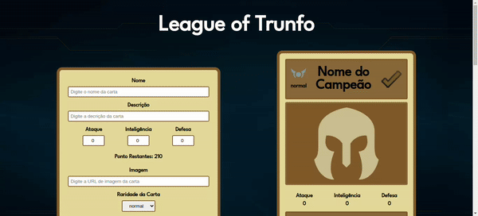

<h1 align="center">League of Trunfo</h1>

<h2 align="center">
Prepare-se para uma experiência de jogo emocionante no estilo Super Trunfo! Com esta aplicação, os jogadores podem criar seu próprio baralho personalizado, adicionando e removendo cartas de acordo com sua preferência. Explore uma variedade de temas e crie baralhos únicos e empolgantes.
</h2>

<h3 align="center">
     <a target="_blank" href="https://jonathankarlinski.github.io/league-of-trunfo/">Testar Projeto</a>
</h3>

<h2>🎨 Demonstração</h2>

    

<h2>🛠 Conhecimentos Utilizados</h2>

- React JS
- Java Script
- CSS
- HTML

<h2>📫 Feedback</h2>

<h3 align="center">
     Se você tiver algum feedback, posso ser encontrado em:
</h3>

   
    

